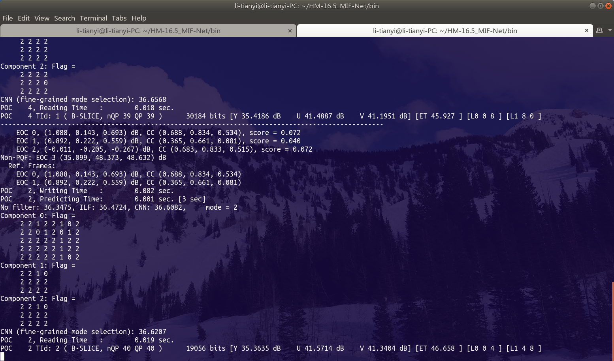

# MultiFrame-InLoop-Filter
Source codes for training and evaluating the multi-frame in-loop filter (MIF) approach. [1]

## Downloadable links (same as the HIF Database): 

Dropbox:

https://www.dropbox.com/sh/cpa4pca3jhvjhn7/AABrw4Oq4ZzvBYTyOziJispra?dl=0

or Baidu Cloud Disk:

https://pan.baidu.com/s/10uVms2eHP9CIEhBke6dB5A

# 1. Training codes

Folder <font color="#0040c0">*HM-16.5_Data*</font> and <font color="#0040c0">*Data_Generation_and_Training*</font> contain the training codes for the proposed MIF approach.

1. Generate pre-required files using "*.bin" files in the HIF Database.
	
	Path into "HM-16.5_exdata/bin/vc10/x64/Release/" and run "TAppDecoder.exe" (for Windows).
	
	Or, path into "HM-16.5_exdata/bin/" and run "TAppDecoderStatic" (for Linux). 
	
	Here, the command file "run.bat" or "run.sh"  is an example to transfer 16 "*.bin" files into pre-required files, containing reconstructed YUV files ("rec.yuv", "rec_nof.yuv"), CU and TU files ("Info_CUDepth.dat", "Info_TUDepth.dat").

2. Create folders to store these pre-required files and then rename them.

	Formats: 
	
	```
	Info_(mode)_(video name)_qp(QP value)_nf(number of frames)_CUDepth.dat
	Info_(mode)_(video name)_qp(QP value)_nf(number of frames)_TUDepth.dat
	rec_(mode)_(video name)_qp(QP value)_nf(number of frames).yuv
	rec_nof_(mode)_(video name)_qp(QP value)_nf(number of frames).yuv
	```
	
	Examples: 
	
	In folder "F:/DataHEVC/RA_Info/", the renamed information files are: 
	
	```
	Info_RA_BasketballPass_416x240_50_qp32_nf500_CUDepth.dat
	Info_RA_BasketballPass_416x240_50_qp32_nf500_TUDepth.dat
	```
	
	In folder "F:/DataHEVC/RA_Rec/", the reconstructed YUV file (after standard in-loop filter) is: 
	
	```
	rec_RA_BasketballPass_416x240_50_qp32_nf500.yuv
	```
	
	In folder "F:/DataHEVC/RA_Rec_nof/", the reconstructed YUV file (no in-loop filter) is: 
	
	```
	rec_nof_RA_BasketballPass_416x240_50_qp32_nf500.yuv
	```
	
	Note: the results after Step 2 can be downloaded at "https://pan.baidu.com/s/1h-3xR3dbIZPos5bNaZoEYA" (code: n170) for demo use, containing the data for 4 YUV files.

3. Path into "Data_Generation_and_Training/". Edit "data_info.py".

   Set YUV_PATH_TRUTH, YUV_PATH_OTHER (YUV files and CU, TU files) and SAMPLE_PATH (to store training, validation and test samples). 

   Set "INDEX_LIST_TRAIN", "INDEX_LIST_VALID" and "INDEX_LIST_TEST" to decide which parts of YUV files are used for training, validation and test.

4. Edit "config.py".

   Set ENCODER_MODE = 'LDP', 'LDB' or 'RA'.

   Set MULTI_FRAME_MODE = 0 or 1.

5. Run "generate_data.py" to get data files.

6. Edit "input_data.py". 

   Set "QP_INDEX_LIST". 

7. Edit "train.py". 

   Set "IS_RELOAD" and "ITER_TIMES". 

   Run "train.py" to generate the models. The codes are based on TensorFlow 1.X (1.15 is recommended), which do not support TensorFlow>=2.0 currently.

Note: Steps 4~7 need to be run multiples times, for obtaining both MIF-Net and IF-Net models (MULTI_FRAME_MODE = 0 and 1) at all four QP values (22, 27, 32, 37).

8. Path into "Data_Generation_and_Training/Models/" to find the model files. 

   Here, one model corresponds to three model files, for example:
   
   ```
   model_20200530_200942_10000_qp22_rec_nof_densenet.dat.data-00000-of-00001
   model_20200530_200942_10000_qp22_rec_nof_densenet.dat.index
   model_20200530_200942_10000_qp22_rec_nof_densenet.dat.meta
   ```

# 2. Test codes

Folder <font color="#0040c0">*HM-16.5_MIF-Net*</font> contains both encoder and decoder for the MIF approach. All source codes are stored in its sub-folder <font color="#0040c0">*HM-16.5_MIF-Net/source*</font>, and the compiled executable files are in <font color="#0040c0">*HM-16.5_MIF-Net/bin*</font>. 

In total, eight C++ files have been modified, as below.

 - source/App/TAppDecoder/TAppDecTop.cpp
 - source/App/TAppEncoder/TAppEncTop.cpp
 - source/Lib/TLibDecoder/TDecSlice.cpp
 - source/Lib/TLibDecoder/TDecGop.cpp
 - source/Lib/TLibDecoder/TDecGop.h
 - source/Lib/TLibEncoder/TEncSlice.cpp
 - source/Lib/TLibEncoder/TEncGOP.cpp
 - source/Lib/TLibEncoder/TEncGOP.h

To run the codec, please refer to file <font color="#0040c0">*HM-16.5_MIF-Net/bin/README.md*</font>.

Below is an example when the encoder is running.



# References

[1] Tianyi Li, Mai Xu, Ce Zhu, Ren Yang, Zulin Wang and Zhenyu Guan, “A Deep Learning Approach for Multi-Frame In-Loop Filter of HEVC,” IEEE TIP, vol. 28, no. 11, pp. 5663-5678, Nov. 2019.
